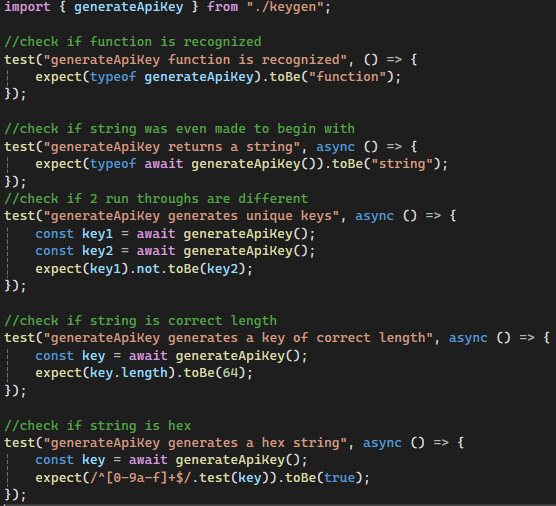
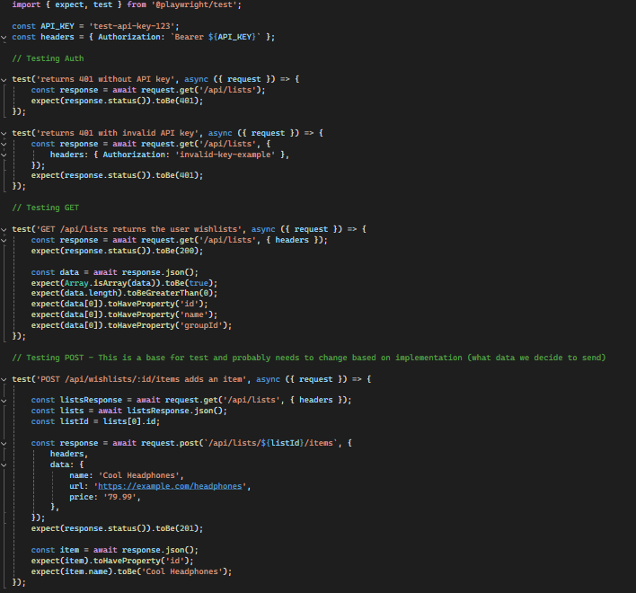

# Universal Wishlist Development
## Purpose
This repository contains our development work for extending the existing Universal Wishlist application. For this project,
we are adding API-related functionality to the original Wishlist application that we forked. These API additions are intended to support our wishlist extension,
which is being developed in a separate repository.

## Accessing the Project
### Cloning the Repository
```sh
git clone https://github.com/UniversalWishList/wishlist.git
```

### Accessing the Project Directory

```sh
cd wishlist
```
### Checking Out the Submission Branch
```sh
git checkout initial_results
```
- This branch contains our latest changes and build history required for this submission.

## Continuous Integration: Viewing Workflows with GitHub Actions


- The __Actions__ tab shows both failing and passing builds from previous push commits made to the __initial_results__ branch.
- For good development practice, we intend for these workflows to run solely on the __main__ branch.
- Workflows that automate unit testing appear under the __Build and Test__ workflow.
- Workflows that generate Docker images from push commits appear under the __Build and Push Docker__ Image workflow.

## Building the Wishlist Application
### Prerequisites
- Before you begin, ensure the following is installed and properly configured:
    - __Docker__ (Docker Engine)
- You can verify installation with:
```sh
docker --version
```

### Starting the Application
-  From the project directory, run one of the following commands to build the Wishlist application image:
```sh
docker build . --tag wishlist-dev:latest
```
- __OR__ (depending on system permissions):
 ```sh
sudo docker build . --tag wishlist-dev:latest
```
- After the image finishes building, run the container with the following command:
```sh
docker run -p 3280:3280 wishlist-dev:latest
```
- __OR__ (depending on system permissions):
```sh
sudo docker run -p 3280:3280 wishlist-dev:latest
```

### Accessing the application
- Once the container is running, open your browser and go to:
```sh
http://localhost:3280/
```
- You should now see the existing Wishlist application interface that we forked from.

### Wishlist Application Running in Browser:


## Running the Unit Tests for API key generation
### Prerequisites
- __node v24.x__
    - Ensure nodejs is installed first
    - If running Ubuntu you can install with:
        - sudo apt install nodejs
    - You can also install __nvm__ which is a node version manager that can be used to install this specific version of node.
    - If installing nvm you can use the following:
        - curl -o- https://raw.githubusercontent.com/nvm-sh/nvm/v0.39.5/install.sh | bash
    - This version  of node can be installed with nvm by using the following command:
        - nvm install 24
- [pnpm](https://pnpm.io/installation) v10.x

### <ins> Initial Setup for Running Unit Tests:
### Install dependencies

```sh
pnpm install
```
- This command may take a while to run the first time.
### Generate SvelteKit files
```sh
pnpm svelte-kit sync
```
- This is required for syncing the project before running the unit tests to resolve SvelteKit types.
### Running the __Jest__ (JavaScript) unit tests
```sh
pnpm test:unit
```
- This executes the JavaScript/TypeScript unit tests using Jest.
### Output of Unit Tests Passing:


## Where to Find Unit Tests?
### Tests Location for API key generation: `tests/apikeygen/`

- The project includes six unit tests covering API key generation behavior.
- These tests check that `generateApiKey` is defined, returns a string, generates unique values, produces the expected length, uses valid hexadecimal characters, and applies the correct `uwl_` prefix.

## keygen.test.ts


### Tests Location for API methods: `tests/api/`

- In addition to the API-key-generation unit tests, this repository also includes automated API tests located in `tests/api/`.
- These tests validate authentication handling, list retrieval, and adding an item to a list through the current API endpoints.

## wishlists.test.ts


### Running the API tests
```sh
pnpm test:ui:api
```

- This command is configured to run the Playwright-based API tests for the API endpoints.
- In our current setup, these tests are most reliably verified through the Build and Test workflow in `GitHub Actions`.
- API test execution is visible under the `Build and Test` workflow in the `GitHub Actions` tab.
- In particular, the `Run Playwright API tests` step shows the Playwright-based API tests running in CI.
- Local execution may fail if Docker is not available through WSL.
- This provides a consistent environment for verifying API behavior when local Docker or WSL configuration prevents the tests from running successfully.