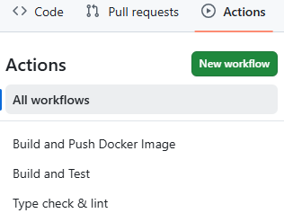
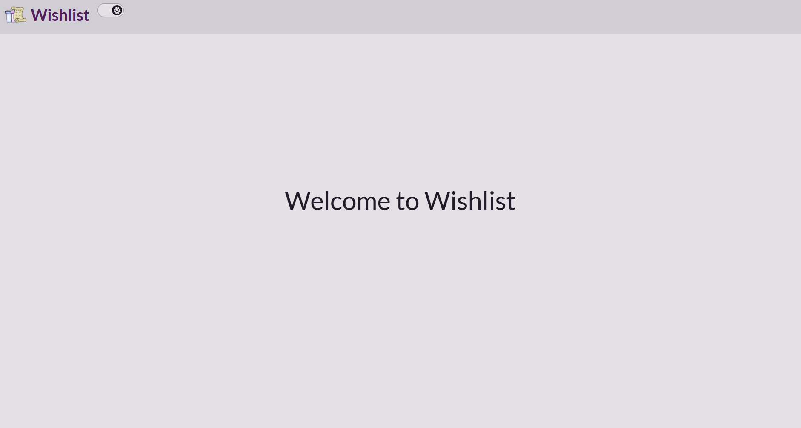
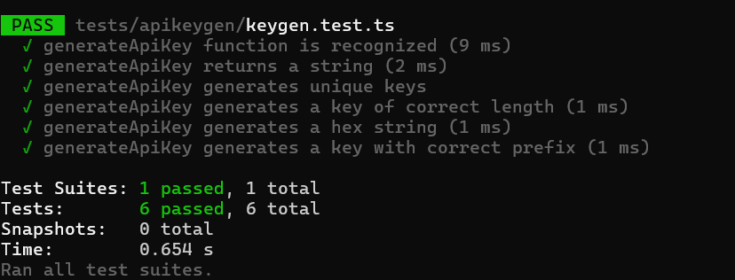
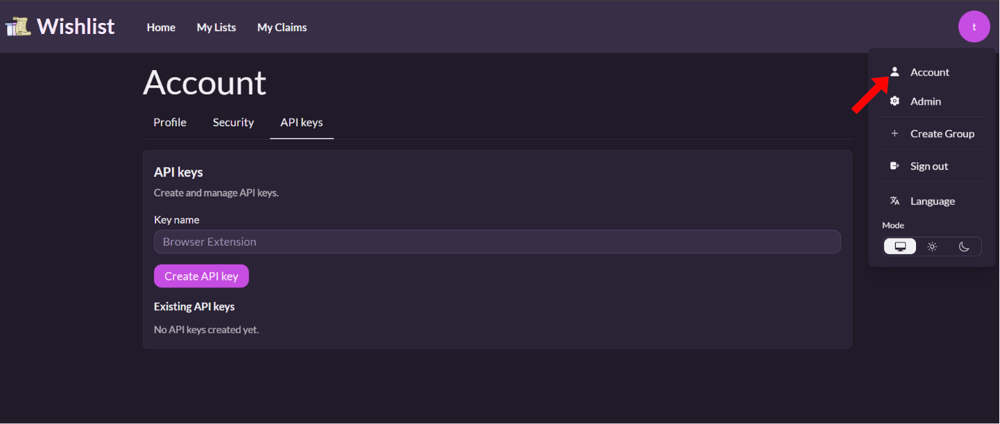
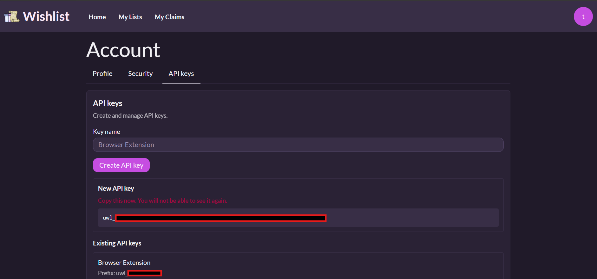
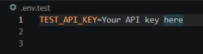
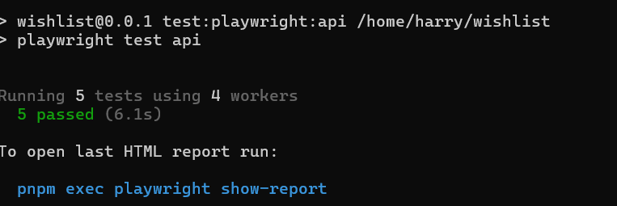
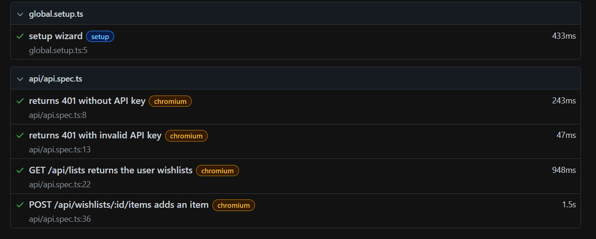
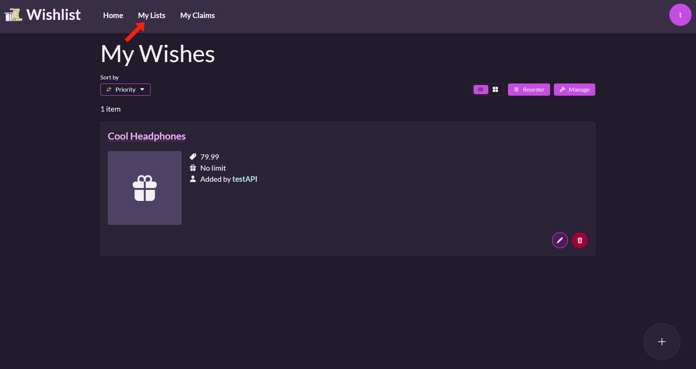
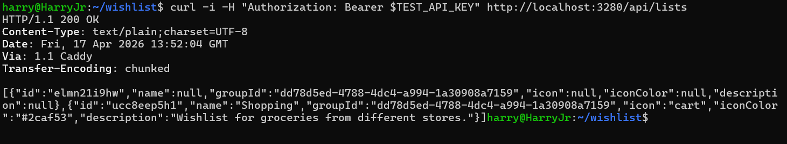

# Universal Wishlist Development
## Purpose
This repository contains our development work for extending the existing Universal Wishlist application. For this project,
we are adding API-related functionality to the original Wishlist application that we forked. These API additions are intended to support our Wishlist Chrome extension, which is being developed in a separate repository within the __Universal Wishlist Organization__, `https://github.com/UniversalWishList/chrome-extension`. API functionality currently includes API key generation within the Wishlist application and API key validation with a POST method for adding an item to a list, and a GET method for fetching list(s) information.

## Accessing the Project
### Cloning the Repository
```sh
git clone https://github.com/UniversalWishList/wishlist.git
```

### Accessing the Project Directory

```sh
cd wishlist
```

## Continuous Integration: Viewing Workflows with GitHub Actions



- The __Actions__ tab shows both failing and passing builds from previous push commits made to the __main__ branch.
- Workflows that automate unit testing appear under the __Build and Test__ workflow.
- Workflows that generate Docker images from push commits appear under the __Build and Push Docker__ Image workflow.

## Building the Wishlist Application
### Prerequisites
- Before you begin, ensure the following is installed and properly configured:
    - __Docker__ (Docker Engine)
- You can verify installation with:
```sh
docker --version
```

### Starting the Application
-  From the project directory, run one of the following commands to build the Wishlist application image:
```sh
docker build . --tag wishlist-dev:latest
```
- __OR__ (depending on system permissions):
 ```sh
sudo docker build . --tag wishlist-dev:latest
```
- After the image finishes building, run the container with the following command:
```sh
docker run -p 3280:3280 wishlist-dev:latest
```
- __OR__ (depending on system permissions):
```sh
sudo docker run -p 3280:3280 wishlist-dev:latest
```

### Accessing the application
- Once the container is running, open your browser and go to:
```sh
http://localhost:3280/
```
- You should now see the existing Wishlist application interface that we forked from.

### Wishlist Application Running in Browser:



### Stopping a Container:
- To list the running container(s):
```bash
docker ps
```
- To stop a running container, use the container name from the output:
```bash
docker kill [name of container]
```
## Running the Unit Tests for API key generation
### Prerequisites
- __node v24.x__
    - Ensure nodejs is installed first
    - If running Ubuntu you can install with:
        - sudo apt install nodejs
    - You can also install __nvm__ which is a node version manager that can be used to install this specific version of node.
    - If installing nvm you can use the following:
        - curl -o- https://raw.githubusercontent.com/nvm-sh/nvm/v0.39.5/install.sh | bash
    - This version  of node can be installed with nvm by using the following command:
        - nvm install 24
- [pnpm](https://pnpm.io/installation) v10.x

### <ins> Initial Setup for Running Unit Tests:
### Install dependencies

```sh
pnpm install
```
- This command may take a while to run the first time.
### Generate SvelteKit files
```sh
pnpm svelte-kit sync
```
- This is required for syncing the project before running the unit tests to resolve SvelteKit types.
### Running the __Jest__ (JavaScript) API key generation unit tests
```sh
pnpm test:unit
```
- This executes the JavaScript/TypeScript unit tests using Jest.
### Output of Unit Tests Passing:




## Where to Find Unit Tests?
### Tests Location for API key generation: `tests/apikeygen/keygen.test.ts`

- The project includes 13 unit tests covering both API key generation and API key hashing behavior.
- The `generateApiKey` tests verify that the function exists, returns a string, produces unique keys, generates keys of the expected length, uses valid hexadecimal characters after the prefix, and applies the correct `uwl_` prefix.
- The `hashApiKey` tests verify that the hashing function exists, returns a string, produces different hashes for the same input because of salting, generates a hash of the expected `bcrypt` length, matches the original API key when checked with `bcrypt`, and does not match a different API key.

### Tests Location for API methods: `tests/api/api.spec.ts`

- In addition to the API-key-generation unit tests, this repository also includes automated API tests for API GET and POST methods.
- These tests validate authentication handling, list retrieval, and adding an item to a list through the current API endpoints with API key validation.

## Running the API tests with API key generation/validation within the Wishlist Application
## ** Creating an API key **
- In order to successfully test the APIs you must first create and account within the wishlist application and an API key.
- So if you've successfully followed the application build instructions and created an account, you should be able to find the 'API keys' within the 'Account' section under your profile icon.
- Note: you __must__ keep the Docker application actively running the whole time when you are running the API tests.

### 'API keys' window


- Now that you've found the 'API keys' window, create and API key by __optionally__ entering a key name in the 'Key name' field.
- Then you can simply click the 'Create API key' button, and you should see that your key has been created.

### API key creation


- Once you have generated an API key, save it in a `.env.test` file. Since the initial terminal may already be running the Docker application, create or edit the `.env.test` file from a separate terminal in the __wishlist__ project root directory.
- The `.env.test` should look as follows:
### `.env.test`


- Note: replace "Your API key here" with your actual API key and no space after the '='.

### Running tests API key validation with API methods
- Once you saved your API key to the `.env.test` file, run the following command in the separate terminal to execute the tests.

## API tests command
```sh
pnpm test:playwright:api
```
- This command is configured to run the Playwright-based API tests for the API endpoints.

## API tests passing
- As a result you should be able to see that API tests have passed.

### API tests passing in terminal


- If you want to see in detail how these tests are passing the terminal may suggest entering the following command:

```sh
pnpm exec playwright show-report
```
- The results should then look as follows within the browser:

### Playwright tests report


## API tests verification

- Once your tests have successfully ran you can verify that the POST method worked within your wishlist application.
- You can verify that the POST method has been called to add "Cool Headphones" to your default wishlist.

- To see that your wishlist has the item, open the 'My Lists' tab and click on the default wishlist, you should then see that the item has been added to the 'My Wishes' window.

### `POST` item to WishList


- For testing the GET method you can alternatively call a `curl` response that returns your list(s) contents.
- To achieve this you can run the following commands:

### `GET` curl response
```sh
source .env.test
curl -i -H "Authorization: Bearer $TEST_API_KEY" http://localhost:3280/api/lists
```
- As a result you should see a `200` success message along with the displayed contents of your list(s):

### `GET` curl response success in terminal


- contents of list(s) consist of `id`, `name`, `groupId`, `icon`, `iconColor`, `description`
- returned as a `JSON` array of objects

# Summary/Modifications to existing project
## Testing
- In our current setup, these tests are most reliably verified through the Build and Test workflow in `GitHub Actions` since the process of running these tests can be quite tedious. Moreover, The process of manually having to create API keys can be laborious, so the API tests in particular are intended to be done in CI.
- As previously mentioned, test execution is visible under the `Build and Test` workflow in the `GitHub Actions` tab.
- In particular, the `Run Playwright API tests` step shows the Playwright-based API tests running in CI along with the `Run Jest tests` for the API key generation tests.
- For CI it is setup so that it is automated to create a test account with an API key within each build in order to test the APIs along with API key validation.
- Logic for this is visible in the `prisma/seed.ts` file, where the `apiTestData` function conditionally creates a dedicated API test user, adds that user to the default group if needed, creates a test wishlist, and stores a hashed version of the `TEST_API_KEY` so that authenticated API tests can run automatically in each CI build.

## Adding API key generation and APIs to the Wishlist Project
- As far as creating the logic needed for the APIs and API key generation we modified the existing project to add this functionality.
- Prior to this there was no interface or UI for generating an API key. So what was needed this was first there had to be a schema for what data came along with the API key.
- You can view the logic for this in `prisma/schema.prisma` where fields are added for `id`, `name`, `keyHash`, etc. within the `ApiKey` model.
- As far as logic for the API key generation we resorted to using `bcrypt` and hashing functionality for that can be visible with the addition of `src/lib/server/keygen.ts`.
- For setting up the UI functionality within the wishlist application to work with API key generation logic, modifications were made to `src/routes/account/+page.server.ts`, `src/routes/account/+page.svelte`, along with the additions of `src/lib/components/account/ApiKeyCard.svelte`, and `src/lib/components/account/ApiKeys.svelte` for handling the logic of API key management (server-side).
- For API logic and methods, we added API key validation to work with API methods, with the addition of `src/lib/server/apiAuth.ts`, and the API GET method at `src/routes/api/lists/+server.ts`, along with modifications made to `src/routes/api/lists/[listId]/items/+server.ts`, to add the POST method.
-  For extracting different fields of an item's URL, that is not limited to the __image__, __name__, and __price__; we added a helper function found at `src/lib/server/productMetadata.ts`, which uses the original project's webscraping logic to extract these different fields from a single URL endpoint. (This is intended to work with the POST method, so within the wishlist browser extension when we add an item to a wishlist, we can add it with the necessary fields such as it's __image__, __name__ and __price__ from the single item URL).
- In addition to all of this, we modified other things for miscellanous/setup reasons. For example we modified __playwright__ and __prisma__ config files to work with our setup and other files for comptability of our API logic and testing reasons as previously mentioned.
